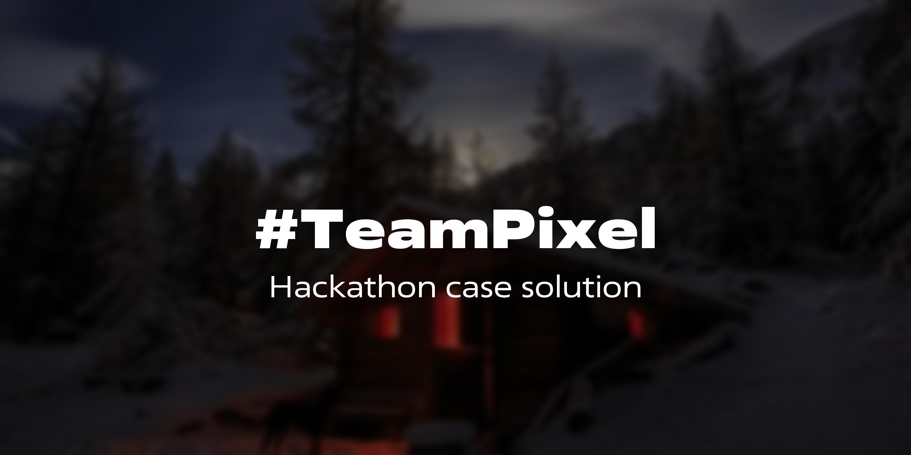

# #TeamPixel case solution 💬

Case description

# Содержание
1. Стек технологий проекта

    1.1. [Библиотеки](#библиотеки)
    
    1.2. [Методологии разработки](#методологии-разработки)

    1.3. [Утилиты](#утилиты)

2. Техническое описание проекта

    2.1. [Базовая настройка проекта](#базовая-настройка-проекта)

    2.2. [Запуск](#запуск)
    kv
    2.3. [Использование](#использование)

    2.4. [Заметки разработчиков](#заметки-разработчиков)

# Стек технологий проекта 🧑‍💻


  
  


#### Библиотеки

- ⚡️ FastAPI — back-end фреймворк
- ⚙️ Starlette — back-end фреймворк (настройка fastapi_cache TemplateResponseCoder, SQLAdmin)
- 👑 SQLAdmin — Настраиваемая панель администратора
- 📜 Swagger — автодокументация RESTful API проекта
- 💾 fastapi_cache2 + aioredis — кэширование Response/TemplateResponse ответов для снижения нагрузки на uvicorn
- 💿 SQLalchemy ORM - ORM базы данных
- ⬆️ Alembic — миграции
- ⛩️ asyncio — принципы асинхронного программирования для реализации более отказоустойчивой системы REST API
- 💛 JS — frontend
- 💜 Bootstrap — font-end фреймворк

#### Методологии разработки

- 🌴 GitFlow — методология управления ветвлениями в GIT
- 🪄 TDD (Test Driving Develop) — методология разработки через тестирование
- 🔁 DI/DIP (Dependency injector, Dependency inversion principle)
- ⚖️ Принципы SOLID при проектировании

#### Утилиты
- 🦄 Uvicorn — веб-сервер
- 💡 Redis — кэширование данных
- 💻 Tmux — для развёртывания проекта
- 🐳 Docker — для помощи в деплое проекта и настройки CI/CD
- 📖 Poetry — пакетный менеджер
- 💾 PostgreSQL в Docker контейнере — СУБД проекта
- ✍️ Pre-commit — инструмент объединения линтеров для проверки качества и работоспособности кода

# Техническое описание проекта ⚙️

### Базовая настройка проекта

1. Скопируйте настройки из файла ```.env.example``` в корне проекта в файл ```.env``` в той же директории
2. Укажите ваши параметры (Для проверяющих мы подготовили уже готовый .env файл с настройками для Docker compose)

### Запуск

С использованием Docker:

```bash
docker-compose up --build
```

Чтобы загрузить тестовые данные выполните команду:
```bash
docker-compose exec web python core/cmds.py loaddata
```

Без использования Docker:
1. Установите redis
2. Установите postgreSQL
3. В корне проекта создайте (если его нет), и/или заполните файл .env содержимым из .env.example:
# Если вы поднимаете не через докер, то обязательно укажите в POSTGRES_HOST установите 127.0.0.1, а если через Docker, то установите db (что и стоит по умолчанию)

```bash
DEBUG=0     # Отключение DEBUG режима
SECRET_KEY=test_secret_key  # Ключ для генерации JWT
CORS_ALLOWED_ORIGINS=http://localhost:3000  # CORS заголовки

# ===== POSTGRES =====
POSTGRES_DB=postgres
POSTGRES_USER=postgres
POSTGRES_PASSWORD=postgres
POSTGRES_HOST=db
POSTGRES_PORT=5432

# ===== TOKENS =====
ACCESS_TOKEN_LIFETIME=300
REFRESH_TOKEN_LIFETIME=86400
REFRESH_TOKEN_ROTATE_MIN_LIFETIME=3600
ALGORITHM=HS256

# ===== REDIS =====
REDIS_HOST=redis
REDIS_PORT=6379
REDIS_DB=0
REDIS_PASSWORD=password

# ==== TEST DATABASE ====
TEST_POSTGRES_DB=test
TEST_POSTGRES_USER=postgres
TEST_POSTGRES_PASSWORD=postgres
TEST_POSTGRES_HOST=db
TEST_POSTGRES_PORT=5432

```
4. Установите зависимости:
```bash
python3 -m pip install -r requirements.txt
```
5. Выполните миграции базы данных:
```bash
alembic upgrade head
```
6. Загрузите тестовые данные:
```bash
python3 core/cmds.py loaddata
```

6. Запустите сервер:
```bash
uvicorn src.main:app --reload
```

### Использование

Перейдите на `http://127.0.0.1:8000/` и наслаждайтесь

### Заметки разработчиков

На некоторых этапах разработки проекта мы создавали заметки в формате `.md` (markdown v2).

Они располагаются в корне проекта в папке `notes/`
